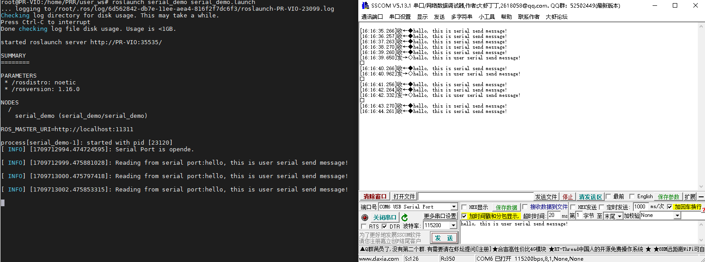

# Serial Communication (UART)

This section introduces how to use the UART interface on Viobot2.


## 1. Interface Definition

Viobot2 provides a 2x4 pin header (female). The mating connector is included in the package.

Row 1 (left to right): `GND`, `SCL`, `SDA`, `GND`

Row 2 (left to right): `RX`, `TX`, `CANL`, `CANH`

The UART device is `ttyS0`, full path: `/dev/ttyS0`.

## 2. Hardware Connection

Here we use Viobot2 connected to a Windows PC with a serial debugging tool as an example. (This example uses the PRO version. For the base version, only the device name differs.)

Use a common USB-to-UART adapter to connect Viobot2 to your PC. Connect GND. Connect Viobot2 `RX` to the adapter `TX`, and Viobot2 `TX` to the adapter `RX`.


## 3. Code Test

This tutorial uses a convenient ROS serial library. You can also implement UART communication yourself. This is meant to be a simple example. Since Viobot2 ships with ROS pre-installed, even if your main project uses ROS you can follow this tutorial to use Viobot2 UART quickly.

### ROS1

#### (1) Install `ros-serial`

Some early devices may not have this installed by default. Install it via APT:

```bash
  sudo apt install ros-noetic-serial
```

#### (2) Build and Run

Build the code in your workspace on Viobot2. The code initializes a serial port, then runs a 1Hz loop that reads incoming UART data and sends a string.

```c++
#include <ros/ros.h>
#include <string>
#include <iostream>
#include <sstream>
#include <serial/serial.h>
#include <std_msgs/String.h>

serial::Serial my_serial;

int my_serial_init(const char* port,uint32_t baudrate){
    my_serial.setPort(port);
    my_serial.setBaudrate(baudrate);
    serial::Timeout timeout = serial::Timeout::simpleTimeout(1000);
    my_serial.setTimeout(timeout);
    my_serial.setParity(serial::parity_t::parity_none);
    my_serial.setBytesize(serial::bytesize_t::eightbits);
    my_serial.setFlowcontrol(serial::flowcontrol_t::flowcontrol_none);
    my_serial.setStopbits(serial::stopbits_t::stopbits_one);
    try{
        my_serial.open();
    }
    catch(const std::exception &e){
        ROS_ERROR_STREAM("Unable to open port.");
        return -1;
    }

    if(my_serial.isOpen()){
        ROS_INFO_STREAM("Serial Port is opende.\n");
    }
    else{
        ROS_ERROR_STREAM("Unable to open port.");
        return -1;
    }
    return 0;
}

int main(int argc,char **argv){
    ros::init(argc,argv,"serial_demo");
    ros::NodeHandle nh;

    my_serial_init("/dev/ttyS0",115200);//base版是/dev/ttyS8

    ros::Rate loop_rate(1);
    while(ros::ok()){
        size_t n = my_serial.available();
        if(n!=0){
            std_msgs::String msg_s;
            msg_s.data = my_serial.read(my_serial.available());
            //这里是把1秒内所有接收到的数据全部打印出来
            //用户可以自定根据接收到的数据进行自己的处理
            ROS_INFO_STREAM("Reading from serial port:"<< msg_s.data);
        }
        std::string msg = "hello, this is viobot serial send message!"; 
        my_serial.write(msg.c_str());
        loop_rate.sleep();
    }
    return 0;
}

```

#### (3) Expected Behavior

```c++
source ./devel/setup.bash
roslaunch serial_demo serial_demo.launch 
```

This simple demo sends a string to the PC every second. When the PC sends a string back to Viobot2, it prints the received data once per second.



### ROS2

#### (1) Install the serial library

In ROS1, you can install the official `serial` library via APT. In ROS2, you may need to build/install it from source depending on your setup.

```bash
sudo apt install ros-humble-serial-driver

```

#### (2) Build

```c++
cd user_ws/src/serial_demo/extern_lib/serial/build
rm -r *
cmake ..
sudo make install
sudo ldconfig
cd ../../../../..
colcon build

```

Build the code in your workspace on Viobot2. The code initializes a serial port, then runs a 1Hz loop that reads incoming UART data and sends a string.

```c++
#include "rclcpp/rclcpp.hpp"
#include "std_msgs/msg/string.hpp"
#include "serial/serial.h"

class Serial_node : public rclcpp::Node{
public:
    Serial_node(const std::string& name):Node(name){
        my_serial_init("/dev/ttyS0",115200);
        timer_ = this->create_wall_timer(std::chrono::milliseconds(1000), std::bind(&Serial_node::timer_callback, this));
    }

private:

    void timer_callback(){
        std::string msg = "hello, this is viobot serial send message!"; 
        my_serial_.write(msg.c_str());
        size_t n = my_serial_.available();
        if(n!=0){
            std::string msg_s;
            msg_s = my_serial_.read(my_serial_.available());
            RCLCPP_INFO(this->get_logger(), "Reading from serial port:%s", msg_s.c_str());
        }
    }

    int my_serial_init(const char* port,uint32_t baudrate){
        my_serial_.setPort(port);
        my_serial_.setBaudrate(baudrate);
        serial::Timeout timeout = serial::Timeout::simpleTimeout(1000);
        my_serial_.setTimeout(timeout);
        my_serial_.setParity(serial::parity_t::parity_none);
        my_serial_.setBytesize(serial::bytesize_t::eightbits);
        my_serial_.setFlowcontrol(serial::flowcontrol_t::flowcontrol_none);
        my_serial_.setStopbits(serial::stopbits_t::stopbits_one);
        try{
            my_serial_.open();
        }
        catch(const std::exception &e){
            RCLCPP_ERROR(this->get_logger(),"Unable to open port.");
            return -1;
        }

        if(my_serial_.isOpen()){
            RCLCPP_INFO(this->get_logger(),"Serial Port is opende.\n");
        }
        else{
            RCLCPP_ERROR(this->get_logger(),"Unable to open port.");
            return -1;
        }
        return 0;
    }
    
    serial::Serial my_serial_;
    rclcpp::TimerBase::SharedPtr timer_;
};

int main(int argc, char **argv){
    rclcpp::init(argc,argv);
    auto node = std::make_shared<Serial_node>("serial_demo");
    rclcpp::spin(node);
    rclcpp::shutdown();
    return 0;
}

```

#### (3) Expected Behavior

```c++
source ./install/setup.bash
ros2 run serial_demo serial_demo 
```

This simple demo sends a string to the PC every second. When the PC sends a string back to Viobot2, it prints the received data once per second.


