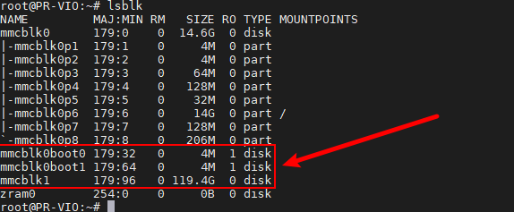
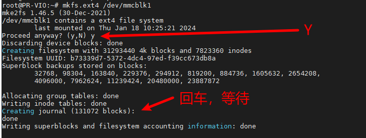
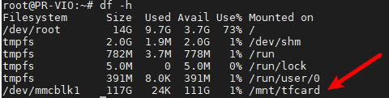
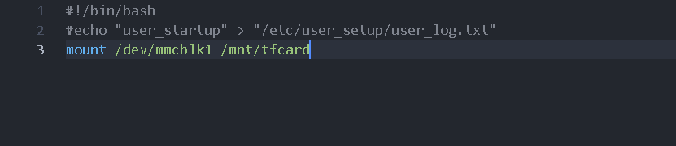

# TF Card Mount

Insert the TF card into the Viobot2 slot. Pay attention to the TF card write speed. Maximum supported capacity is **128GB**.

## 1. Check the TF Card

```bash
lsblk
```



You should see a new block device (e.g. ~119.4G), which is the TF card you just inserted. In this example it is `mmcblk1`.

Viobot2 does not support NTFS-formatted TF cards. If you need to store large files, format the TF card as EXT4. If the card is not empty, back up your files before formatting.

## 2. Format the TF Card

```bash
sudo mkfs.ext4 /dev/mmcblk1 
```



## 3. Mount

```bash
sudo mkdir /mnt/tfcard
sudo mount /dev/mmcblk1 /mnt/tfcard
```

Verify:

```bash
df -h
```



You should see `/dev/mmcblk1` mounted at `/mnt/tfcard`.

## 4. Unmount

```bash
sudo umount /dev/mmcblk1
```

## 5. Auto-mount on Boot

Mounting is not persistent: after reboot, you need to mount again. To auto-mount on boot, ensure `/mnt/tfcard` exists, then append `mount /dev/mmcblk1 /mnt/tfcard` to the last line of `"/etc/user_setup/user_startup.sh"`, save, and reboot.


