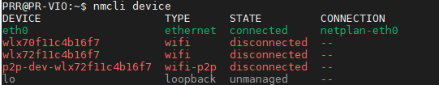
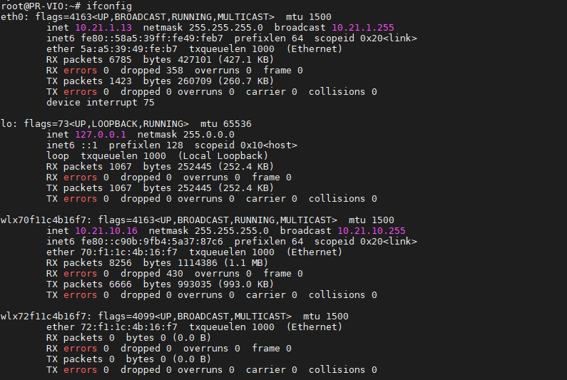

# 网卡挂载与WiFi连接

Viobot2设备本身不具备无线功能，我们其实更推荐使用有线连接的方式使用，这样会更稳定，但如果确实想要使用无线测试的话，我们提供了无线网卡的驱动和安装方式。

无线网卡驱动属于外接的驱动，需要编译系统对应的驱动文件，所以我们现在只支持少数的几个无线网卡驱动。现在以我们自己测试常用的无线来作教程说明。（本教程使用的是8818eu无线网卡）


### 1.把驱动文件放到设备里面（正常设备里面已有驱动，不需要自己手动放进去）


打开了一个网络文件夹，用户：root 密码：PRR


查看samba文件夹里面是否有module文件夹，如果没有则新建,(一般已放有驱动在里面)。


把8188\_wifi.ko文件拉到module文件夹下


### 2.网卡挂载

挂载网卡：

ssh进到设备里面，用户：PRR 密码：PRR

```bash
sudo insmod /home/user/module/8818_wifi.ko
```

### 3.连接wifi

#### 1）查看设备状态

```bash
nmcli device
```



这里的网卡名称为`wlx70f11c4b16f7`

#### 2）搜索wifi

```bash
nmcli device wifi list #会出来可见的WIFI列表
```


#### 3）连接无线热点

```bash
 sudo nmcli device wifi connect "PRROBOT" password "12345678" #PRROBOT对应你的SSID,12345678对应你的密码
```

#### 4）查看连接状态

```bash
nmcli connection show
```


#### 5）查看当前网络IP

输入`ifconfig`查看当前连接的ip



用自己的电脑ping一下wifi的ip测试是否能用，需注意网段。

#### 6）其他

这个方式直接连接wifi的IP是自动分配的，如果需要设置静态IP：

```bash
sudo nmcli connection modify PRROBOT ipv4.addresses '10.21.10.16/24' ipv4.gateway '10.21.10.1' ipv4.dns '8.8.8.8' ipv4.method manual

```

`PRROBOT`对应`nmcli connection show`显示的`name`，ip : `10.21.10.16` ，掩码需要换算一下：`255.255.255.0`对应`24` ，网关：`10.21.10.1`，DNS：`8.8.8.8`  注意：静态IP需要保证你设置的IP不会与别的设备冲突。

如果要重新设置为自动获取IP：

```bash
sudo nmcli connection modify PRROBOT  ipv4.method auto 
```

设置完之后需要重新连接一下：

```bash
sudo nmcli connection up PRROBOT  
```

再重新用ifconfig查看ip即可

### 4.设置开机自动连接wifi

```bash
sudo vim /etc/user_setup/user_startup.sh
```

添加安装驱动命令，保存退出，重启即可。


#### 5.其他指令

```bash
nmcli connection delete my-wifi #删除已经创建的网络连接配置my-wifi
```

改名

```bash
nmcli connection modify "Wired connection 1" connection.id "wired1"

```
