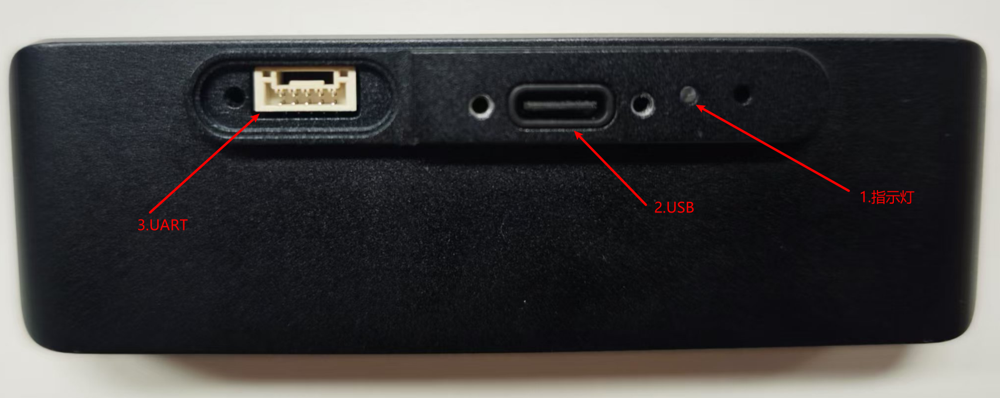
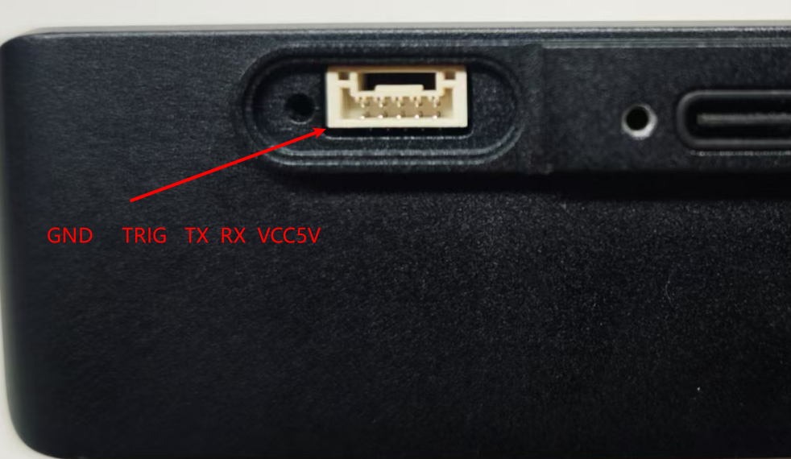

# 硬件接口说明

指示灯闪烁就表示设备正常运行了。

mini作为一个整体系统，是不开放系统给用户做开发的，可以通过外引的两个硬件接口收发数据。

## 1.USB

设备外引一个USB2.0接口，已经做好配置，插到电脑上面会给电脑创建一个新的网卡，并且通过dhcp的方式给电脑分配一个192.168.1.X的ip（X在11\~20之间）。对于一些嵌入式板子，可能需要开启系统内核的一个功能（详见`USB网卡配置`），如果插上直接可用，就不需要做这个设置。

这个USB可以同时用作设备供电口，但需要注意输入功率，部分嵌入式板子板载的USB输出口如果电流太低有可能出现断连接的现象。

## 2.UART

UART的接口为GH1.0的5pin，从螺丝孔那里开始从左到右分别是GND、TRIG、TX、RX、5V。

如果是单纯串口通信的话就是接GND、TX、RX即可，需要注意的是串口电平是3.3V的如果接了5V会把串口烧掉。如果是直接供电的话可以接上5V的供电线。TRIG线可用做外部传感器触发信号线。

详细的串口通信协议和教程参考`串口通信`。
