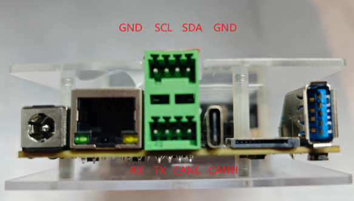
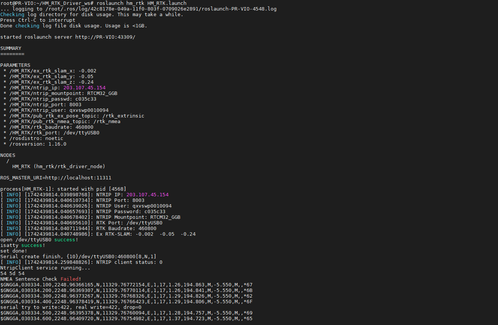
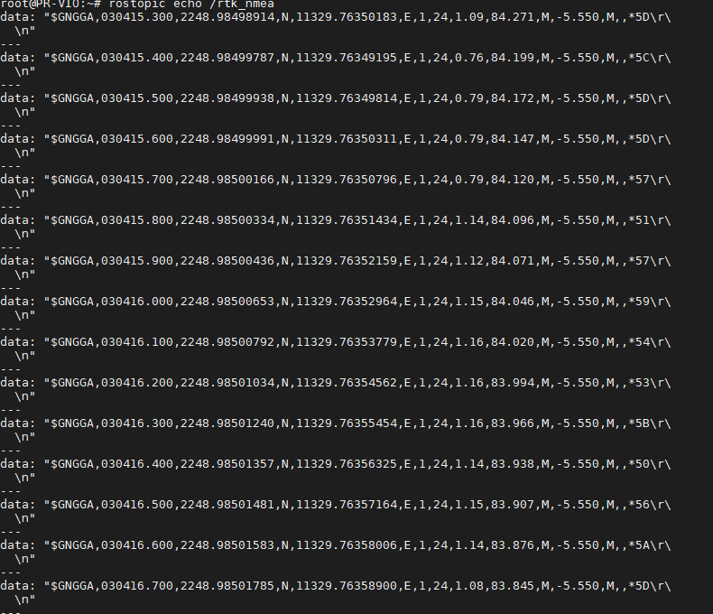
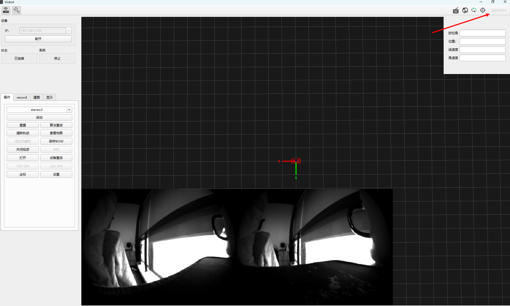
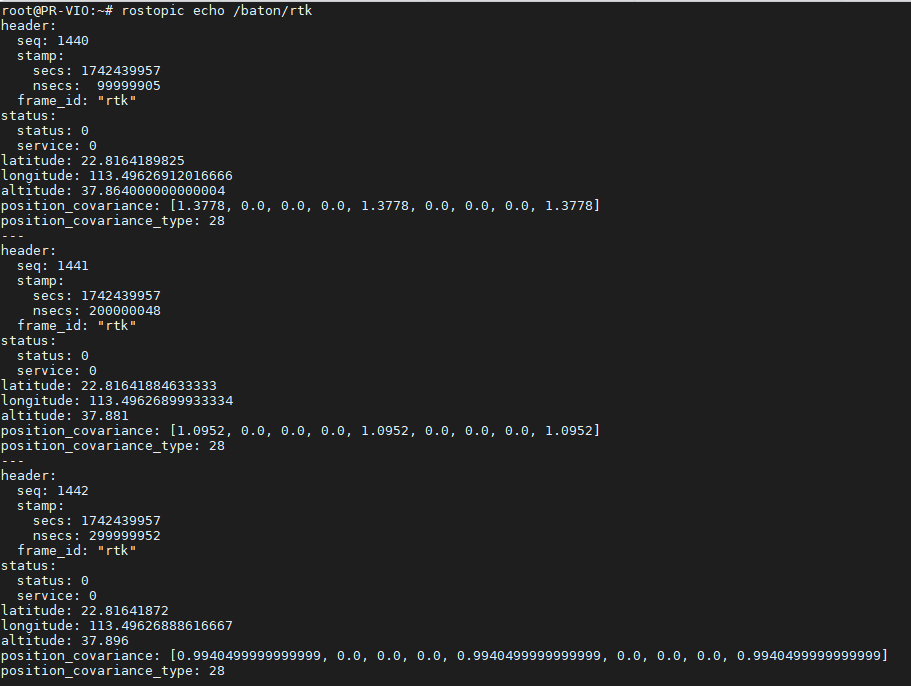

# Visual + RTK Fusion (Single Antenna)

Viobot2 includes a GNSS module by default. The algorithm runs in **GVIO** mode by default, and falls back to **VIO** when GNSS data is not available. Viobot2 also supports an external RTK module. When RTK data is provided, GNSS data will be discarded automatically, and the algorithm fuses RTK to output more accurate positions.

High-level steps:

0. [Hardware preparation](#1-hardware-preparation)
1. [Build and install dependencies](#2-driver-and-dependencies)
2. Build the RTK driver
3. [Connect RTK via serial](#21-hardware-connection)
4. [Calibrate RTK-to-left-camera extrinsics](#35-calibrate-rtk-to-left-camera-extrinsics)
5. [Enable RTK fusion](#4-rtk-fusion)

## 1. Hardware Preparation

Viobot2 does not ship with an RTK module. Choose your own RTK module if needed.

RTK requirements:

- Output NMEA-0183 standard NMEA **GGA** fixed-solution results at **10Hz+**
- Output **RMC** sentences (provides UTC time/date information)

Viobot2 subscribes to external GGA strings via ROS topic `/rtk_nmea` (precondition: enable RTK mode on Viobot2: UI -> Settings -> GNSS -> check **RTK**).

Data flow (simplified):


## 2. Driver and Dependencies

Hessian Matrix provides an open-source RTK driver repo: [Hessian-matrix/HM_RTK_driver](https://github.com/Hessian-matrix/HM_RTK_driver).

It depends on `ceres_solver`. You can use the packaged archive on Gitee and build/install it:

```bash
git clone https://gitee.com/hessian_matrix/ceres_slver-2.1.0.git
cd ceres_slver-2.1.0
unzip ceres-solver-2.1.0.zip
cd ceres_solver-2.1.0
mkdir build && cd build
cmake ..
sudo make install -j4
```

Build the driver:

```bash
mkdir -p HM_RTK_Driver_ws/src
cd HM_RTK_Driver_ws/src
git clone https://github.com/Hessian-matrix/HM_RTK_driver
cd HM_RTK_driver
git submodule init
git submodule update
cd ../../
catkin_make
```

### 2.1 Hardware Connection

Connect the RTK module to Viobot2 via serial.

- If you use a USB-to-serial adapter, check the device name with `ls /dev/ttyUSB*`.


- If you use the rear UART header, the port is `ttyS0`.



Write the correct serial port into `hm_rtk.launch`:


About PPS: user versions include a GNSS board. The antenna receives satellite time, so PPS time synchronization is available.

### 2.2 Test the Driver

```bash
cd HM_RTK_Driver_ws
source ./devel/setup.bash
roslaunch hm_rtk hm_rtk.launch
```

If it starts normally and you can see `/rtk_nmea` messages, it is OK:



```bash
rostopic echo /rtk_nmea
```



## 3. Data Integration and Extrinsic Calibration

### 3.1 Check Required Versions

RTK requires the client UI version **20250314 or later**, and the device `software` version **20250318 or later**. It is recommended to update firmware from the official website before use.




### 3.2 Enable RTK Mode on Viobot2

Connect Viobot2 with the client UI, click **Settings**, go to the GNSS page. GNSS and RTK are mutually exclusive. Check **RTK** (GNSS will be unchecked), then click **OK**.


Close the settings page, then click **Reboot Device** to reboot Viobot2.

### 3.3 Start RTK Driver and Feed Data into Viobot2

After building the driver and confirming hardware connection, start the RTK driver:

```bash
roslaunch hm_rtk hm_rtk.launch
```

The driver sends RTK data to Viobot2 for parsing. Verify that `/baton/rtk` is published:



### 3.4 Verify Fixed Solution

```bash
rostopic echo /baton/rtk
```

If `status = 2`, the RTK is in fixed-solution mode.

### 3.5 Calibrate RTK-to-Left-Camera Extrinsics

After confirming data is correct, open `hm_rtk.launch` and set the initial value of Y:


Restart the RTK driver:

```bash
roslaunch hm_rtk hm_rtk.launch
```

Start stereo3, then run the calibration launch:

```bash
roslaunch hm_rtk calib_rtk_slam.launch
```

After both stereo3 and calibration are running, move the Viobot2 + RTK antenna assembly quickly in random directions. Avoid standing still or moving in a straight line. A figure-8 motion is recommended. The algorithm uses the latest 10 seconds of data for calibration. After calibration finishes, press `Ctrl+C` to stop; the calibration results will be printed in the terminal.


## 4. RTK Fusion

Write the calibration results back into `HM_RTK.launch`:

```xml
<arg name="ex_rtk_slam_x" default="-0.026357"/>
<arg name="ex_rtk_slam_y" default="-0.05"/>
<arg name="ex_rtk_slam_z" default="-0.283098"/>
```

Then start the RTK driver again, start stereo3, and move the device. After RTK reaches fixed solution, you will get fused results.

After RTK data is parsed, the following RTK-related topics are available:

> **The fused trajectory is published on `/baton/stereo3/fusion_odom`. This topic fuses GNSS/RTK/relocalization as available (fuses whichever sources are present).**

```bash
/baton/stereo3/fusion_odom  # fused odometry in SLAM local frame
/baton/stereo3/fusion_path  # fused path in SLAM local frame
/baton/stereo3/rtk_path     # RTK path in SLAM local frame
/baton/stereo3/lla_odom     # fused odom: XYZ are lat/lon/alt (deg, m); orientation in ENU frame
```

## 5. About Time Synchronization

Currently there are two time synchronization methods for RTK/GNSS:

1. When using the onboard GNSS antenna together with RTK fusion, the device can use PPS time synchronization via the onboard GNSS module.
2. The RTK driver publishes NMEA-GGA and NMEA-RMC messages; the algorithm parses satellite time to synchronize system time.

Both methods synchronize **system time**, and topic timestamps are based on the synchronized time.

