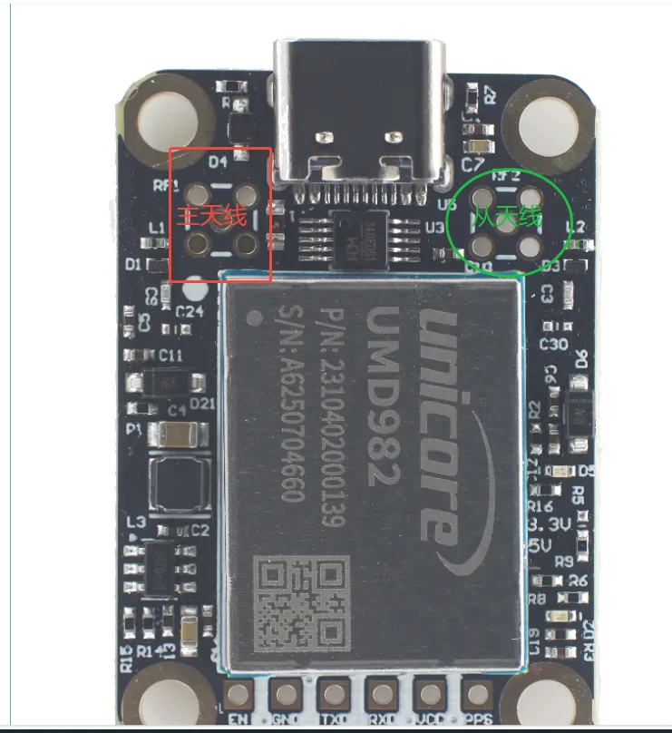
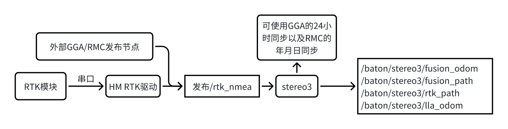
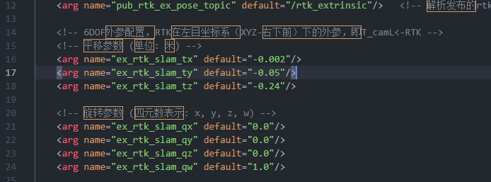
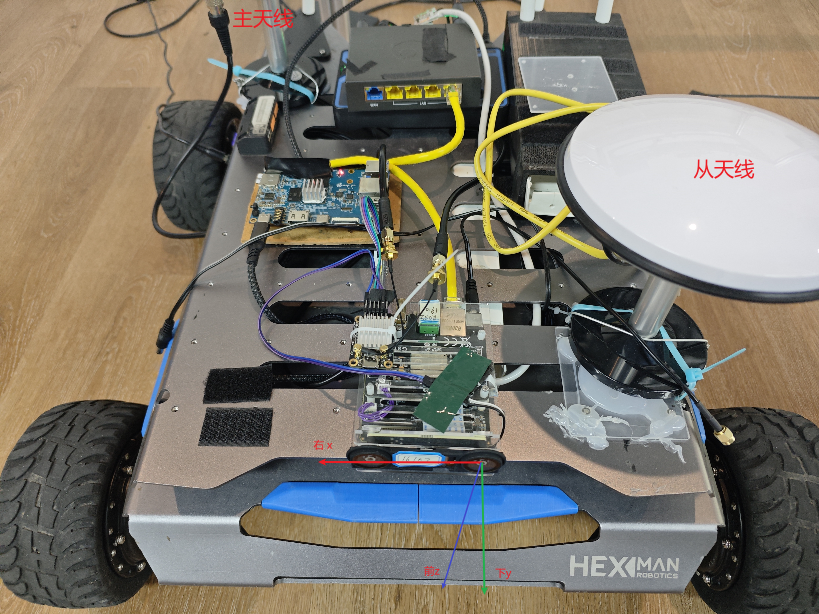
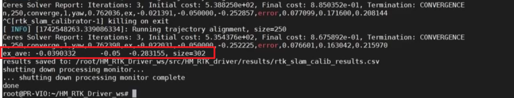
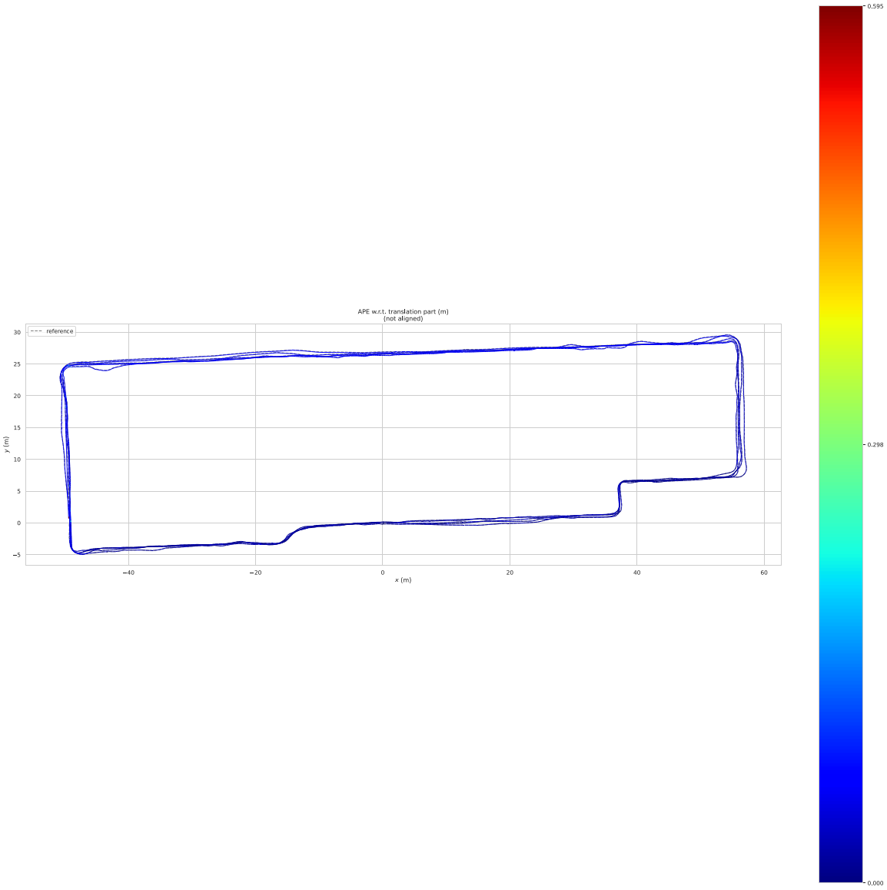

# 视觉融合双天线RTK

<font color='#FF0000'>注意：此功能需要V2510xx及之后的版本支持</font>

双天线RTK顾名思义可以提供俩个天线定位信息，意味着除了能获得定位信息外，还可以获得朝向信息。

Viobot2算法默认为VIO模式，在没有接入双天线RTK数据时融合位姿输出的是VIO的位姿，有双天线RTK数据并且成功初始化之后融合位姿输出的就是视觉+RTK做融合的位姿，意味着融合位姿不仅会像RTK一样准确，而且即使在弱信号甚至无信号时融合位姿都可以持续输出。

viobot2使用RTK模块的大致步骤如下：

0. [硬件准备]()
1. [预先编译安装依赖 参考单天线RTK]()
2. [编译RTK驱动 参考单天线RTK]()
3. [串口连接RTK模块]()
4. [RTK外参标定]()
5. [开启RTK融合算法]()

## 一.硬件准备

目前Viobot2适配的双天线RTK只有维特智能的UM982这一款，使用时需要开启\$GGA 10hz
\$RMC 1hz \#AGRICA 10hz的输出,通过以下的指令修改输出输出：
```
1. 配置串口波特率（这里是用com1输出）
Config com1 460800
2. 配置流动站工作模式
MODE ROVER 
3. 串口上电默认无输出，配置GGA、RMC输出：
GPGGA COM1 0.1
GPRMC COM1 1
4. 配置定向固定解
GPTHS 1
AGRICA COM1 0.1
5. 使能pps
CONFIG PPS ENABLE GPS POSITIVE 500000 1000 0 0
6. 永久保存配置
SAVECONFIG
```
um982模块

 
<center style="font-size:14px;color:#C0C0C0;">um982模块</center> 

所以数据流的简图基本等同单天线RTK版本，和单天线模块唯一不同的是话题消息中多了AGRICA报文：



## 二.模块驱动&外参标定

提前在Viobot-UI上勾选RTK，并选择双天线版本，执行重启，使用`roslaunch hm_rtk hm_rtk.launch`启动RTK驱动，然后确保查看到`/rtk_nmea`和`/baton/rtk_sixdof`消息输出；

这里使用的是HM_RTK的开源驱动仓库，硬件连接、使用方法等步骤与单天线的RTK使用方式相同，唯一有区别的是标定部分。


### 2.1 确定固定解
确保固定解：使用topic echo /baton/rtk_sixdof,按照以下注释的说明进行判断：

```shell
---
header:
  stamp:
    sec: 1757985729
    nanosec: 401312000
  frame_id: rtk
child_frame_id: ''
pose:
  pose:
    position:
      x: -2345251.8804
      y: 5394243.9843
      z: 2458010.9024
    orientation:
      x: 0.05099666757356264
      y: -0.00417499227936327
      z: -0.9953600365410679
      w: -0.08148807883870496
  covariance:
  - 0.00020449000000000002
  - 4.0e-08     #位置固定解状态，非4则非固定解  这里用的是协方差非对角线上的元素的【状态 * e-8】来表示
  - 4.0e-08     #定向固定解状态，非4则非固定解
  - 0.0
  - 3.4000000000000003e-07
  - 0.0
  - 0.0
  - 0.00052441
```


### 2.2 标定RTK与左目外参

上面几步确认数据正常后，打开hm_rtk.launch,设置好Y轴初始设定值，以及标定的初始值



```xml
calib_rtk_slam.launch:

<launch>
    <node name="rtk_slam_calibrator" pkg="hm_rtk" type="calib_rtk_slam_node" output="screen">
        <param name="ex_rtk_slam_x" value="0.03"/>   <!-- 坐标系: 以左目为原点, XYZ-右下上, 即T_camL<-RTK -->
        <param name="ex_rtk_slam_y" value="-0.01"/>  <!-- 必需项，高程方向退化，不参与优化 -->
        <param name="ex_rtk_slam_z" value="-0.24"/>
        <param name="ex_rtk_slam_yaw" value="30.0"/>  <!-- 单位：deg，从SLAM坐标系到RTK坐标系的偏航角。逆时针正，顺时针负 -->
        <param name="package_path" value="$(find hm_rtk)"/>
    </node>
</launch>

```



重新开RTK驱动

```
roslaunch hm_rtk hm_rtk.launch
```

启动stereo3算法，并且开启RTK驱动里面的标定程序

```bash 
roslaunch hm_rtk calib_rtk_slam.launch
```

确认stereo3正常启动，标定程序正常启动后，移动Viobot2和RTK天线的组合体，随机多方向快速运动，避免静止或直线运动，推荐绕8运动，算法会截取最新的10s数据进行标定。标定完成后，`ctrl+C`结束程序，标定的结果会输出在终端上。



## 三、RTK融合

把标定结果重新写到HM\_RTK.launch，ros2的修改`"install/hm_rtk/share/hm_rtk/launch/hm_rtk_ros2.launch.py"`对应的参数。

```xml 
<arg name="ex_rtk_slam_x" default="-0.026357"/>  
<arg name="ex_rtk_slam_y" default="-0.05"/>
<arg name="ex_rtk_slam_z" default="-0.283098"/>
```


然后重新把RTK驱动开起来，开启stereo3算法，运动过后等到RTK有固定解后，就会有RTK的融合结果了。

算法接收到RTK数据解析，然后可以给出以下新的RTK相关话题数据。

```bash 
/baton/stereo3/fusion_odom  #融合后的odometry，在SLAM局部坐标系下
/baton/stereo3/fusion_path  #融合后的历史轨迹，在SLAM局部坐标系下
/baton/stereo3/rtk_path     #RTK历史轨迹，在SLAM局部坐标系下
```
> 注意：目前判断RTK是否融合RTK的方式可以通过判断`/baton/stereo3/rtk_path`是否发布以及`/baton/stereo3/fusion_odom`和`/baton/stereo3/odometry`的位姿是否一致；

## 四、关于时间同步

现在RTK/GNSS PPS时间同步方式：
一是前面说到的在接入GNSS天线再使用RTK算法时设备已经通过设备板载的GNSS模块接入了PPS时间同步；
二是改造Viobot，需要重新焊出pps和GND线

这两种时间同步方式都是同步的系统的时间，各个话题的时间都是基于同步后的时间作为时间戳。

## 五、精度测试报告

| 路径长度 | 绝对轨迹误差RMSE|
|---------|-----------|
| 1353.41米  |   0.0325  |



