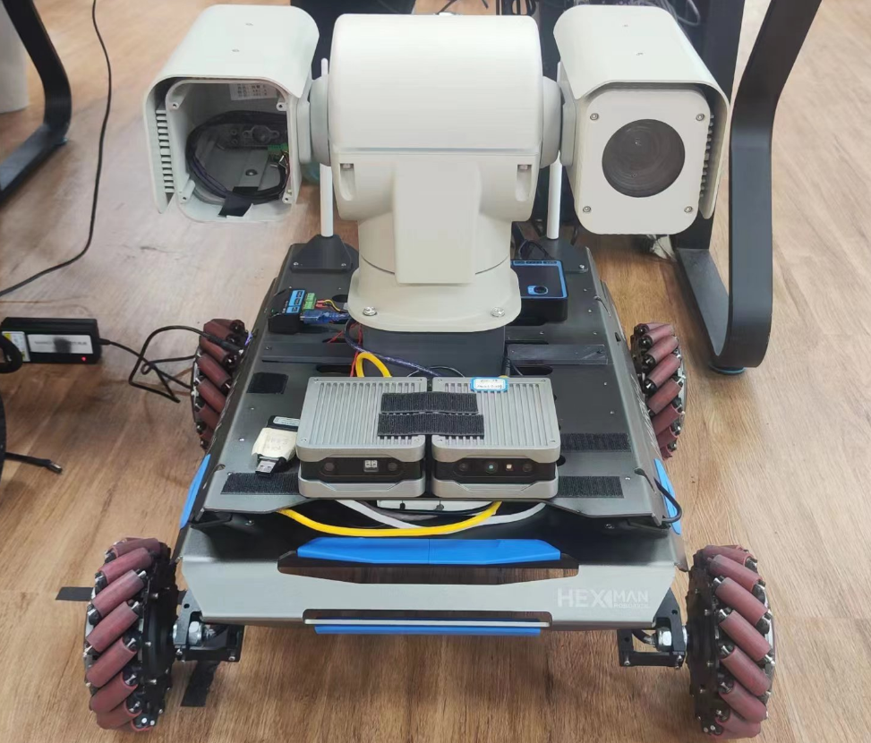
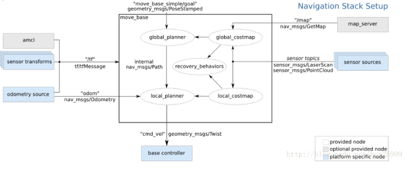
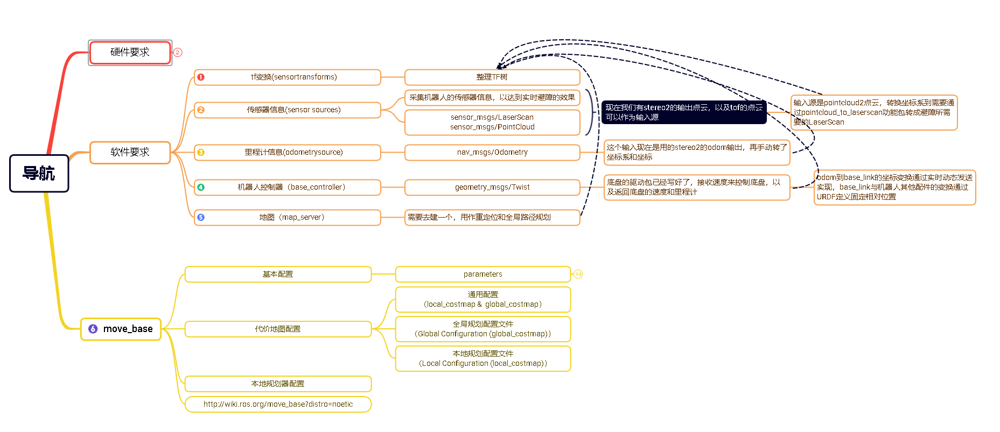
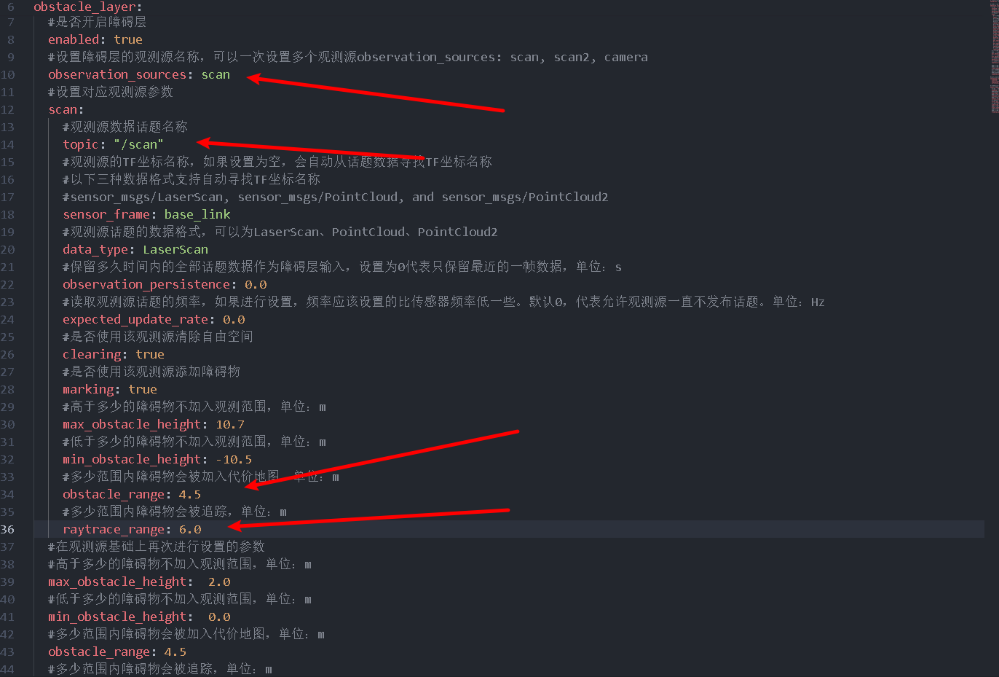

# ROS MoveBase Demo

Demo repo: [Hessian-matrix/nav_demo (viobot use for navigation)](https://github.com/Hessian-matrix/nav_demo)

Note: this tutorial uses a wheeled robot as an example. Real applications usually require additional integration and development.



For path planning we use `move_base`, which is commonly used for wheeled robots.

Overall architecture: Viobot provides the robot pose from the `stereo2` algorithm, which is fed into `move_base` as the planning start. After you set a goal, `move_base` outputs `/cmd_vel` to drive the robot. The base controller (converting `/cmd_vel` to actual chassis control) is application-specific and must be implemented by the user; here we assume it already exists.



Below is an overall architecture diagram:



Next is a high-level walkthrough of the demo.

## 1. Process Viobot Outputs

Subscribe to stereo2 pose and point cloud, then use TF to build a TF tree.

### 1) Subscribe topics and register callbacks

```c++
std::string point_clound_topic;
//点云话题配置接口，可以通过launch文件配置点云输入，默认为TOF
nh_private.param<std::string>("point_clound_topic", point_clound_topic, "/pr_loop/tof_points");

sub_odom = nh.subscribe("/pr_loop/odometry_rect", 50, &VioOdomNodelet::loop_pose_callback, this);
sub_car_odom = nh.subscribe("/odom", 50, &VioOdomNodelet::car_odom_callback, this);
sub_pointcloud = nh.subscribe(point_clound_topic, 50, &VioOdomNodelet::loop_pointclound_callback, this);
```

### 2) Process pose in callback

Maintain a dynamic TF transform from `base_link` to `vio_odom`.

```c++
void VioOdomNodelet::loop_pose_callback(const nav_msgs::OdometryPtr &msg){
    static tf::TransformBroadcaster odom_broadcaster;//定义tf 对象
    geometry_msgs::TransformStamped odom_trans;//定义tf发布时需要的类型消息
    nav_msgs::Odometry odom;

    odom.header.stamp = msg->header.stamp;
    odom.header.frame_id = "vio_odom";
    odom.child_frame_id = "base_link";
    Eigen::Vector3d position_in_vio(msg->pose.pose.position.x, msg->pose.pose.position.y,msg->pose.pose.position.z);
    
    tf::Quaternion original_quat(msg->pose.pose.orientation.x, msg->pose.pose.orientation.y, msg->pose.pose.orientation.z, msg->pose.pose.orientation.w);
    
    //选转到跟base_link方向一致
    tf::Quaternion quat_rotate;
    quat_rotate.setRPY(0, -M_PI/2, M_PI/2);
    // quat_rotate.setRPY(0,M_PI/2, -M_PI/2);

    // Apply the rotations
    tf::Quaternion final_quat = original_quat * quat_rotate;
    
    // Convert the final quaternion back to a geometry_msgs Quaternion
    geometry_msgs::Quaternion geo_q;
    tf::quaternionTFToMsg(final_quat, geo_q);

    if(height_charge){//一个将Z轴归零的策略，可根据自己的实际情况配置
        frame_z = msg->pose.pose.position.z;
        position_in_vio.z() = 0;
        odom.pose.pose.position.z = 0;//z轴归零
        //这里为了把位姿朝向规整到水平面
        vio_quat = geo_q;
        // printf("--------------------\npose:\nx:%lf\ny:%lf\nz:%lf\nquat:\nx:%lf\ny:%lf\nz:%lf\nw:%lf\n",msg->pose.pose.position.x,msg->pose.pose.position.y,
        //                                                             msg->pose.pose.position.z,msg->pose.pose.orientation.x,msg->pose.pose.orientation.y,
        //                                                             msg->pose.pose.orientation.z,msg->pose.pose.orientation.w);
        double yaw = tf::getYaw(vio_quat);
        // geometry_msgs::Quaternion geo_q1 = tf::createQuaternionMsgFromYaw(yaw + M_PI / 2);
        geometry_msgs::Quaternion geo_q1 = tf::createQuaternionMsgFromYaw(yaw);

        odom.pose.pose.orientation = geo_q1;
    }
    else{
        odom.pose.pose.position.z = msg->pose.pose.position.z;
        odom.pose.pose.orientation = geo_q; 
    } 

    position_in_vio = position_in_vio + t_vio_base_link;

    // Coordinate transformation from VIO to base_link
    // odom.pose.pose.position.x = position_in_vio.x();
    // odom.pose.pose.position.y = position_in_vio.y();
    // odom.pose.pose.position.z = position_in_vio.z();
    odom.pose.pose.position.x = msg->pose.pose.position.x;
    odom.pose.pose.position.y = msg->pose.pose.position.y;

    //这里odom的速度可选stereo2输出的速度，也可以选择底盘论速计的速度
    // odom.twist.twist.linear.x = msg->twist.twist.linear.x;
    // odom.twist.twist.linear.y = msg->twist.twist.linear.y;
    odom.twist.twist.linear.x = linear_vx;
    odom.twist.twist.linear.y = linear_vy;
    odom.twist.twist.linear.z = 0.0;
    odom.twist.twist.angular.x = 0.0;
    odom.twist.twist.angular.y = 0.0;
    odom.twist.twist.angular.z = angular_vz;
    // odom.twist.twist.angular.z = msg->twist.twist.angular.z;

    odom_trans.header.stamp = msg->header.stamp;
    odom_trans.header.frame_id = "vio_odom";
    odom_trans.child_frame_id = "base_link";
    odom_trans.transform.translation.x = position_in_vio.x();//x坐标
    odom_trans.transform.translation.y = position_in_vio.y();//y坐标
    odom_trans.transform.translation.z = position_in_vio.z();//z坐标        
    odom_trans.transform.rotation = odom.pose.pose.orientation;//偏航角
    odom_broadcaster.sendTransform(odom_trans);

    //区分静止和运动时的协方差
    if(msg->twist.twist.linear.y == 0 && msg->twist.twist.linear.x == 0 && msg->twist.twist.angular.z == 0){
        memcpy(&odom.pose.covariance, odom_pose_covariance2, sizeof(odom_pose_covariance2));
        memcpy(&odom.twist.covariance, odom_twist_covariance2, sizeof(odom_twist_covariance2));
    }
    else{
        memcpy(&odom.pose.covariance, odom_pose_covariance, sizeof(odom_pose_covariance));
        memcpy(&odom.twist.covariance, odom_twist_covariance, sizeof(odom_twist_covariance));
    }
    pub_odom.publish(odom);
}
```

### 3) Process point cloud in callback

Set the point cloud frame to `vio_odom`. It will be transformed according to the dynamic TF from `base_link` to `vio_odom` defined above.

```c++
void VioOdomNodelet::loop_pointclound_callback(const sensor_msgs::PointCloud2ConstPtr& cloud_msg_in){
    sensor_msgs::PointCloud2 cloud_msg_out = *cloud_msg_in;

    // Set the frame_id of the output pointcloud to base_link
    cloud_msg_out.header.frame_id = "vio_odom";

    if(height_charge){
        Eigen::Quaterniond q(vio_quat.w, vio_quat.x, vio_quat.y, vio_quat.z);
        Eigen::Matrix3d rotation_matrix = q.normalized().toRotationMatrix();

        //将Eigen::Matrix3d 手动转换为 tf::Matrix3x3
        tf::Matrix3x3 tf_rotation_matrix(rotation_matrix(0, 0), rotation_matrix(0, 1), rotation_matrix(0, 2),
                                        rotation_matrix(1, 0), rotation_matrix(1, 1), rotation_matrix(1, 2),
                                        rotation_matrix(2, 0), rotation_matrix(2, 1), rotation_matrix(2, 2));

        double yaw, pitch, roll;
        tf_rotation_matrix.getRPY(roll, pitch, yaw);

        //创建pitch和roll的逆旋转
        Eigen::Matrix3d pitch_matrix_inv = Eigen::AngleAxisd(-pitch, Eigen::Vector3d::UnitY()).toRotationMatrix();
        Eigen::Matrix3d roll_matrix_inv = Eigen::AngleAxisd(-roll, Eigen::Vector3d::UnitX()).toRotationMatrix();

        Eigen::Matrix3d final_rotation_matrix;
        // 应用逆旋转到原始四元数上
        if(inv){
            final_rotation_matrix = pitch_matrix_inv * roll_matrix_inv;
        }
        else{
            final_rotation_matrix << 1,0,0,0,1,0,0,0,1;
        }

        sensor_msgs::PointCloud pointcl1;
        sensor_msgs::convertPointCloud2ToPointCloud(cloud_msg_out,pointcl1);
        for(int i = 0;i < pointcl1.points.size();i++){
            Eigen::Vector3d point_eigen(pointcl1.points[i].x, pointcl1.points[i].y, pointcl1.points[i].z);
            point_eigen = final_rotation_matrix * point_eigen;
            pointcl1.points[i].x = point_eigen.x();
            pointcl1.points[i].y = point_eigen.y();
            pointcl1.points[i].z = point_eigen.z() - frame_z;
            // printf("frame_z = %lf\n",frame_z);
        }
        sensor_msgs::convertPointCloudToPointCloud2(pointcl1,cloud_msg_out);  
    }
    pub_pointcloud.publish(cloud_msg_out);
}
```

## 2. Convert PointCloud to LaserScan

This is based on an existing open-source implementation with a small change: when `use_inf` is set to `false`, points beyond `range_max` are not shown, which makes costmap updates harder in some cases. Before publishing `/scan`, we add an extra 1.5m so the initial `/scan` becomes a fan-shaped output of `range_max + 1.5`, and then obstacles can update it properly.

## 3. `move_base` Configuration

### 1) Launch file

Mainly starts `map_server` to load the map, and starts `move_base` with the configuration files.

```xml
<launch>
    <!-- Run the map server -->
    <node name="map_server" pkg="map_server" type="map_server" args="$(find nav_robot)/maps/map_office.yaml"/>
    <!-- <node name="map_server" pkg="map_server" type="map_server" args="$(find nav_robot)/maps/blank_map.yaml"/> -->


    <node pkg="move_base" type="move_base" respawn="false" name="move_base" output="screen">
        <rosparam file="$(find nav_robot)/config/mark_1/costmap_common_params.yaml" command="load" ns="global_costmap" />
        <rosparam file="$(find nav_robot)/config/mark_1/costmap_common_params.yaml" command="load" ns="local_costmap" />
        <rosparam file="$(find nav_robot)/config/mark_1/local_costmap_params.yaml" command="load" />
        <rosparam file="$(find nav_robot)/config/mark_1/global_costmap_params.yaml" command="load" />
        <rosparam file="$(find nav_robot)/config/mark_1/move_base_teb_params.yaml" command="load" />
        <rosparam file="$(find nav_robot)/config/mark_1/teb_local_planner_params.yaml" command="load" />
    </node>
    <!-- <node name="rviz" pkg="rviz" type="rviz" args="-d $(find nav_robot)/rviz_cfg/nav_test.rviz" /> -->

</launch>
```

### 2) Map file

You need a prior map of your environment. You can build it using LiDAR or other sensors, or also use Viobot (mapping is a separate topic and is not covered here).

### 3) `move_base` config files

Each file has detailed parameter comments. You can read them and tune as needed.

One important part in `costmap_common_params.yaml`:

The obstacle layer input is `/scan`. We do not feed point clouds directly because, in the `move_base` stack, obstacle handling is based on point clouds in the world frame; in practice, using body-frame observations is often more reasonable for local obstacle avoidance. Therefore we convert point clouds within a certain height range into `/scan`. Also note `obstacle_range` and `raytrace_range`: obstacles are raytraced within `raytrace_range`, but only obstacle points within `obstacle_range` are inserted into the costmap. The extra 1.5m added when publishing `/scan` helps place most points between `obstacle_range` and `raytrace_range`, so obstacles refresh more quickly.


